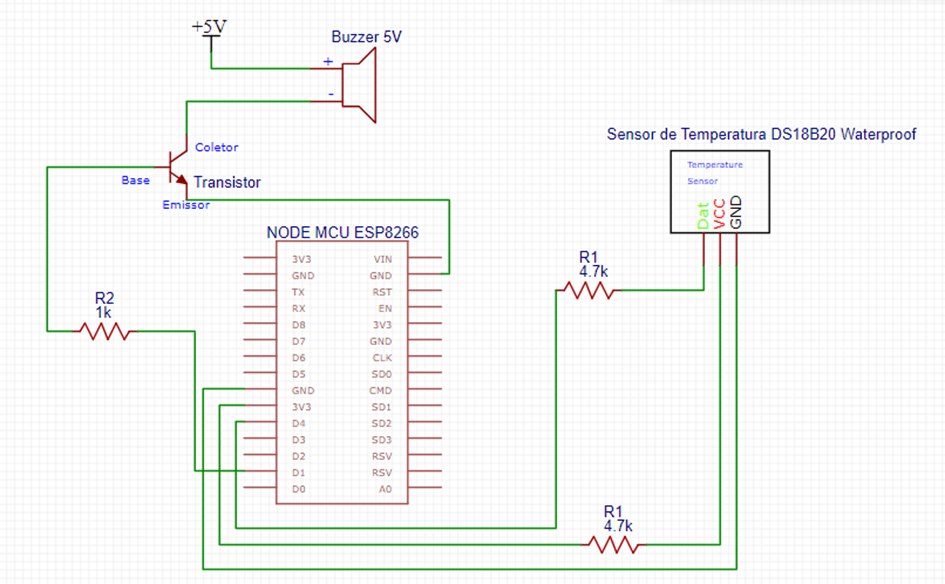
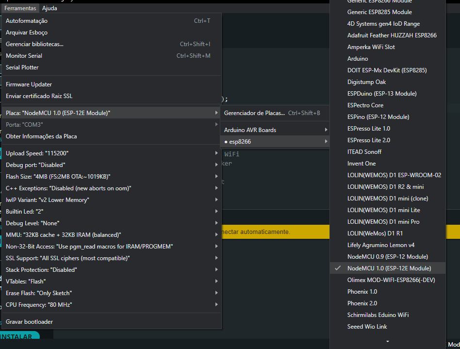
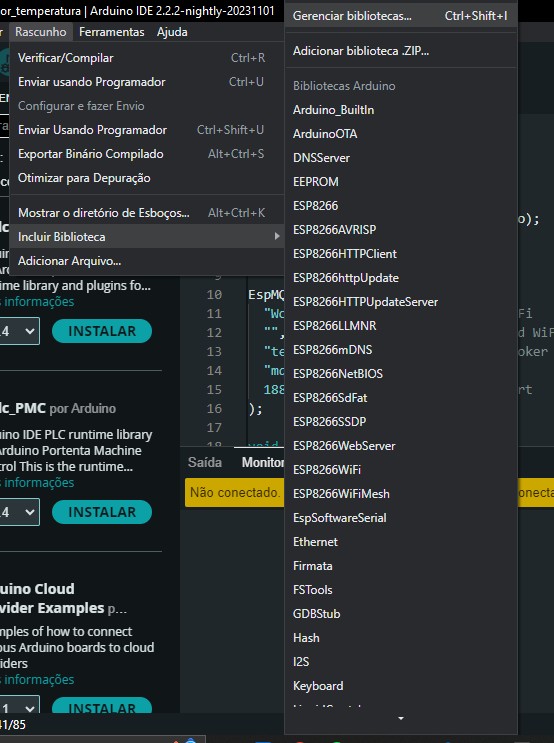
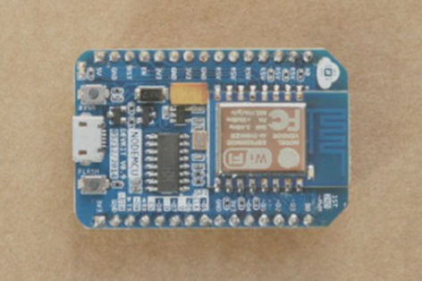
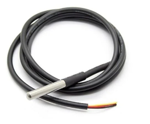
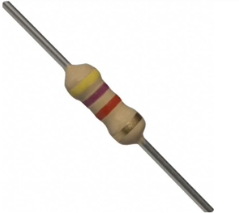
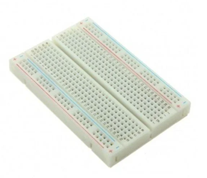
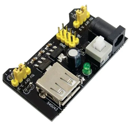
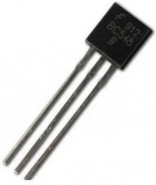

# Sensor de Temperatura em Solo com Base em Arduino para Gestão de Culturas

## I) Descrição do Funcionamento e Uso:
Este projeto trata-se de um protótipo de Sensor de Temperatura em Arduino para monitoramento do solo em plantações, com o intuito de alertar agricultores sobre temperaturas críticas e tomar medidas para proteger as culturas, melhorando a produtividade e prevenindo incêndios.

Para a reprodução do protótipo será necessário obter os materiais descritos na sessão "II) Descrição do Hardware" deste documento

A conexão dos componentes se dará da seguinte maneira:

###### Passo a Passo:
1.	Montagem Física do Circuito:
Os componentes (sensor de temperatura, buzzer e resistor) serão interligados e conectados à protoboard para facilitar as conexões elétricas.
Na protoboard será conectada uma fonte ajustável para protoboard que fornecerá a energia necessária ao nosso sistema.

2.	Conexão do Sensor de Temperatura do Solo:
O sensor de temperatura do solo (DS18B20) será conectado ao pino de dados 3V3, ao pino D4 e ao pino GND do NodeMCU, utilizando a protoboard. Entre os pinos de alimentação 3V3 e o de dados D4 será necessário a ligação de um resistor de 4,7K Ω.

3.	Conexão do Buzzer:
Para conectar o buzzer utilizaremos o transistor BC548 ao invés de conectá-lo na corrente GPIO. Para a conexão do transistor é recomendado utilizar um resistor de 1K. No terminal “base” do transistor é onde conectaremos a o resistor e receberá o sinal do microcontrolador NodeMCU conectado na porta D1. O terminal “coletor” será conectado o terminal negativo do buzzer. E por fim será conectado o positivo do buzzer no VCC da fonte. (Medium, 2014)

4.	Conexão do Ambiente de Desenvolvimento:
Será utilizada a IDE Arduino para escrever, compilar e carregar o código no NodeMCU ESP8266.

5.	Programação do NodeMCU:
Será escrito um código em Arduino para a leitura da temperatura do solo utilizando o sensor DS18B20. Caso a temperatura atingir o valor limite pré-estabelecido, o buzzer será acionado.

6.	Conexão à Rede Wi-Fi:
O NodeMCU será programado para se conectar à rede Wi-Fi local, a fim de possibilitar a comunicação com o servidor MQTT.

7.	Configuração do Protocolo MQTT:
Será utilizada a biblioteca “PubSubClient” a fim de estabelecer uma comunicação com o servidor MQTT. A placa NodeMCU será configurada para publicar os dados de temperatura em um determinado tópico.

8.	Monitoramento da Temperatura e Acionamento do Alarme:
O dispositivo irá monitorar a temperatura, e no caso dela ultrapassar o limite estabelecido, irá acionar o buzzer gerando um alerta sonoro.

9.	Comunicação MQTT:
Os dados da temperatura capturados serão publicados em um tópico MQTT, permitindo um monitoramento e acompanhamento do histórico das temperaturas adquiridas.

######Software:
Para finalizar a montagem e ver o protótipo em funcionamento, será necessário realizar o download do arquivo "codigo_sensor_temperatura.ino" presente neste repositório e abri-lo na ArduinoIDE.

Será necessário configurar a Arduino IDE para ESP8266, para isso, basta seguir o seguinte tutorial disponilizado no link abaixo:
https://blog.smartkits.com.br/esp8266-como-programar-o-nodemcu-atraves-da-arduino-ide/#:~:text=Configurando%20o%20Arduino%20IDE%20para%20o%20ESP8266&text=Para%20acessar%20o%20gerenciador%20e,que%20utilize%20o%20microcontrolador%20ESP8266.

Obs: é importante a instalação do driver da placa que foi adquirida.
Informe à Arduino IDE a placa que está sendo utilizada ("NodeMCU 1.0 (ESP-12E Module)") e a porta que está conectada. 

Após realizar os procedimentos descritos no link, basta baixar as bibliotecas "OneWire", "DallasTemperature" e "EspMQTTClient" clicando em:
Rascunho>Incluir Biblioteca> Gerenciar Bibliotecas

Digite o nome de cada biblioteca descrita e clique em "Instalar" para realizar o download. 

Feito isso, o próximo passo é se certiciar de que seu protótipo está conectado ao seu computador e clicar no botão "Enviar usando programador" para que seu código seja enviado a placa e inicie o funcionamento:

###### Funcionamento:
O sensor de temperatura de solo DS18B20 Waterproof medirá a temperatura do solo e a converterá em um sinal elétrico para ser lido pela placa. Para a utilização deste sensor é necessário um resistor de 4,7K Ω entre o pino de alimentação 3V3 e o de dados D4, o resistor fará o trabalho de limitar a corrente elétrica, protegendo os demais componentes e garantindo que a corrente seja apropriada para eles. (Medium, 2019)
A placa microcontroladora NodeMCU, por sua vez, será responsável por ler os dados enviados pelo sensor de temperatura, processá-los e tomar as decisões escritas na lógica do código que será inserido nela, que no caso, é acionar o buzzer assim que atingir a temperatura limite determinada. É importante salientar que os dados coletados pela placa serão enviados à nuvem através do protocolo MQTT para que possam ser feita análises para tomadas de decisões mais assertivas.
Caso a temperatura captada pelo sensor atinja o limite estabelecido, a placa microcontroladora acionará o buzzer, que emitirá um sinal sonoro, indicando que a temperatura alcançou seu limite com o intuito do Agricultor tomar as medidas cabíveis. O buzzer será acionado pelo transistor ao invés da porta GPIO para receber a voltagem ideal para seu funcionamento. 
Para fornecer a tensão elétrica necessária para o funcionamento dos componentes, com o auxílio de uma fonte de 9V será utilizada uma fonte ajustável para protoboard, que é responsável por fornecer diferentes níveis de tensão elétrica aos dispositivos do projeto.
A conexão entre todos os dispositivos citados ocorrerá através de uma protoboard com o auxílio de jumpers. A protoboard permitirá a montagem do dispositivo sem a necessidade de sondagem, e os jumpers auxiliarão nas conexões elétricas entre os dispositivos.

## II) Descrição do Hardware:
1.	Placa Microcontroladora ESP8266 NodeMCU

Utilizada como unidade de processamento central para o sistema de monitoramento. Esta placa contém uma unidade de comunicação sem fio (Wi-Fi)

 

Figura 1: Placa NodeMCU ESP8266. Fonte: https://www.nodemcu.com/index_en.html

É uma placa de desenvolvimento que utiliza uma combinação de chip ESP8266, que permite a implementação de acesso à rede Wi-Fi com qualquer microcontrolador, uma interface usb-serial, além de um regulador de tensão 3.3V. A programação será realizara utilizando a IDE do Arduino, utilizando a comunicação via cabo micro-usb. Esta placa já possui uma antena embutida e um conector micro-usb para a realização da conexão ao computador, além de 11 pinos de I/O e um converso analógico-digital. (Blog Eletrogate, 2018)

2.	Sensor de Temperatura do Solo DS18B20 Waterproof:
Sensor à prova d’água para medição da temperatura do solo.

 

Figura 2: Sensor de Temperatura DS18B20 Waterproof. Fonte: https://www.eletrogate.com/sensor-de-temperatura-ds18b20-a-prova-dagua
O DS18B20 é um sensor de temperatura que proporciona leituras precisas em uma faixa de 9 a 12 bits. Essas leituras refletem a temperatura de um dispositivo ou ambiente específico. A comunicação deste sensor ocorre através de um protocolo de barramento de um fio, utilizando uma linha de dados para estabelecer a comunicação com um microprocessador interno. Além disso, o DS18B20 obtém sua alimentação diretamente da linha de dados, eliminando assim a necessidade de uma fonte de alimentação externa. As aplicações deste sensor de temperatura abrangem uma variedade de domínios, incluindo sistemas industriais, produtos de consumo, sistemas sensíveis termicamente, controles termostáticos e termômetros. (Blog Eletrogate, 2020).
Será utilizado no projeto como sensor, para capturar a temperatura do ambiente e transmiti-la para o NodeMCU que conterá a lógica para atingir o objetivo do projeto.
	
3.	Buzzer Ativo 5v
Componente utilizado para a produção de alerta sonoro em caso de temperatura do solo fora dos limites estabelecidos

 

Figura 3: Buzzer Ativo 5v. Fonte:https://www.eletrogate.com/buzzer-ativo-5v

Trata-se de um pequeno alto-falante compacto projetado para produzir sinais sonoros ao receber uma alimentação de 5V DC. Não requer componentes externos para gerar sinais ou oscilações, bastando a alimentação com corrente contínua. A principal função do Buzzer Ativo é emitir sinais sonoros como forma de alerta, permitindo ao operador estar ciente de eventos específicos. O acionamento do buzzer ocorre por intermédio de um microcontrolador, o qual, ao detectar determinados eventos, ativa o buzzer, gerando um sinal sonoro para o operador. 
Será utilizado no projeto como um atuador, emitindo um sinal sonoro assim que o sensor capturar uma temperatura que será definida como limite.

4.	Resistor de 4.7k - Resistor 1K
Resistor utilizado para conectar o sensor de temperatura ao NodeMCU

Figura 4: Resistor de 4.7k Ohms. Fonte:https://www.eletrogate.com/resistor-4k7-1-4w-10-unidades
O resistor é um componente fundamental que regula a circulação da corrente elétrica dentro de um circuito. Através do fenômeno conhecido como efeito joule, o resistor converte energia elétrica em energia térmica. Na prática, esse dispositivo se opõe à passagem da corrente elétrica, apresentando resistência ao seu fluxo. (Blog Stoodi, 2021).
O resistor 4.7k Ohms será utilizado entre os pinos de alimentação 3V3 e o de dados D4. Já o resistor de 1K Ohm será necessário para conexão do terminal base do transistor.

5.	Jumpers Macho/Macho / Jumpers - Macho/Fêmea
Serão utilizados para realizar as conexões elétricas entre os componentes do circuito.

 

Figura 5: Jumpers Macho/Macho. Fonte: https://www.eletrogate.com/jumpers-macho-macho-65-unidades

6.	Protoboard 400 pontos
Placa de prototipagem utilizada para facilitar as conexões entre os componentes eletrônicos.

 

Figura 6: Protoboard 400 pontos. Fonte: https://www.eletrogate.com/protoboard-400-pontos
A Protoboard é uma ferramenta altamente útil na montagem de circuitos eletrônicos, proporcionando uma abordagem rápida, fácil e prática para a implementação de projetos. Com uma disposição de 400 pontos, apresenta uma parte inferior adesiva que permite a fixação em uma superfície isolante. Dessa disposição, 100 pontos são destinados à distribuição e 300 pontos são voltados para a conexão terminal. Adicionalmente, a Protoboard apresenta coordenadas coloridas, facilitando a visualização e organização dos componentes no momento da montagem. (Eletrogate, 2023).

7.	Cabo USB para Micro USB
Utilizado para fornecer a alimentação necessária ao NodeMCU e conectá-lo ao computador para permitir a transmissão dos dados para a placa.

 

Figura 7: Cabo USB para Micro USB. Fonte: https://www.eletrogate.com/cabo-micro-usb-azul-30-cm

8.	Fonte 9v 1A Bivolt
Fonte para fornecer a voltagem e a corrente elétrica adequadas para alimentar a fonte ajustável para a protoboard.

 

Figura 8: Fonte 9v 1A Bivolt. Fonte: https://www.eletrogate.com/fonte-5v-1a
9.	Fonte Ajustável Para Protoboard
É um componente projetado especificamente para alimentar circuitos em uma placa de prototipagem (protoboard) de forma regulada e ajustável.

 

Figura 9: Fonte Ajustável Para Protoboard. Fonte: https://www.eletrogate.com/fonte-ajustavel-para-protoboard
Esta fonte será conectada a outra fonte DC de 9V, e converterá sua tensão para 5V, permitindo o fornecimento ideal para os componentes conectados no sistema.

10.	Transistor NPN BC548
Um transistor é um dispositivo eletrônico que tem diversas funções, como amplificar sinais, atuar como interruptor eletrônico, regular tensão, comutar cargas, gerar oscilações e amplificar sinais de alta frequência. 

 

Figura 10: Transistor NPN BC548. Fonte: https://www.eletrogate.com/transistor-npn-bc548
A conrrente de consumo do buzzer quando ligado geralmente passa de 20mA, que normalmente é o limite de corrente por porta dos microcontroladores. No caso o limite da corrente por GPIO é de aproximadamente 12mA, por conta disso o transistor será fundamental no projeto.
O transistor será utilizado para acionar o buzzer pela fonte, ao invés da porta GPIO, assim criando um driver. (Medium, 2023)

## III) Documentação do protocolo de comunicação: https://mqtt.org/